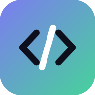

# Playground — Learn to Code

A Swift Playgrounds–style, hands-on way to learn **Python** and the **web**
(HTML, CSS, JavaScript). Every lesson runs for real, right in the browser — no
setup, no account, works on any device.



## What it is

- **Two full courses — 57 lessons across 19 chapters:**
  - 🐍 **Python** (10 chapters, 30 lessons) — printing, variables, decisions,
    loops, lists, functions, strings, dictionaries, error handling, and classes.
  - 🌐 **Web** (9 chapters, 27 lessons) — your first page, links/lists/images,
    CSS styling, flexbox layout, JavaScript, forms, events, animations, and
    capstone mini-apps (click counter, color changer, mood board).
- **Real execution.** Python runs in your browser via
  [Pyodide](https://pyodide.org/) (WebAssembly) in a Web Worker, so a runaway
  loop never freezes the UI. Web lessons render in a sandboxed live preview with
  a captured console.
- **Guided lessons with real goals.** Each lesson checks your actual output
  and code (and, for the web, the live DOM) so you know when you've truly got
  it — with progressive hints and a reveal-the-solution escape hatch.
- **Free-play Sandbox** for both Python and the web.
- **Saves your progress** locally (no account needed).
- **Installable PWA** — add it to your home screen / dock and it works offline.

## Run it

```bash
npm install
npm run dev      # start the dev server (copies Pyodide in first)
npm run build    # type-check + production build into dist/
npm run preview  # serve the production build locally
```

Requires Node 18+.

## Tested

Beyond type-checking, there's a real end-to-end browser test that opens **every
lesson** in headless Chromium, reveals the known-good solution, runs it, and
asserts the grader reports all goals met — so the runtime, live preview, checker,
and lesson content are verified together.

```bash
npm run build && npm run preview &   # serve dist on :4173
npm run e2e                          # 57/57 lessons pass end-to-end
```

## How it reaches every platform

This is one web codebase delivered as a **Progressive Web App**, so it installs
and runs as an app on **Windows, macOS, iOS, iPadOS, Android, and the web** from
a single source of truth — just open it and "Add to Home Screen" / "Install".

To ship signed native binaries, wrap the same `dist/` build with
[Tauri](https://tauri.app/) (Windows/macOS/Linux desktop) or
[Capacitor](https://capacitorjs.com/) (iOS/iPadOS/Android) — exact commands are
in [`docs/NATIVE.md`](docs/NATIVE.md).

> Honest note: native iOS/iPadOS/macOS binaries require Xcode + an Apple
> machine to compile and sign, and Windows binaries require a Windows/MSVC
> toolchain. The web/PWA target builds and runs fully cross-platform from any
> OS, which is why it's the primary delivery here.

## Architecture

```
src/
  curriculum/        Pure-data lessons (python/ and web/) + the type schema
  runtime/           Pyodide worker + controller, web preview bundle, checker
  components/        Editor (CodeMirror), Console, Preview, Checklist, Mascot…
  pages/             Home, CoursePage, LessonPage, SandboxPage
  store/             Progress (zustand + localStorage)
  styles/            Design tokens + component styles
```

Lessons are **plain serializable data** (`Lesson` objects with declarative
`CheckRule`s), so the curriculum is easy to extend, validate, and reuse.
